# StreamVLN Training Pipeline Flowchart

```mermaid
flowchart TB
    A["Start: train()"] --> B["Parse Arguments"]
    B --> C["Initialize Training Environment"]
    C --> D["Model Setup"]
    D --> E["Tokenizer Setup"]
    E --> F["Vision Tower Setup"]
    F --> G["Gradient Configuration"]
    G --> H["Data Module Creation"]
    H --> I["Trainer Initialization"]
    I --> J["Training Loop"]
    J --> K["Model Saving"]
    K --> L["End"]

    subgraph "Parse Arguments"
        direction TB
        B1["HfArgumentParser"]
        B2["ModelArguments"]
        B3["DataArguments"]
        B4["TrainingArguments"]
        B1 --> B2
        B1 --> B3
        B1 --> B4
    end

    subgraph "Initialize Training Environment"
        direction TB
        C1["Set local_rank"]
        C2["Set compute_dtype"]
        C3["Quantization Setup"]
        C4["DeepSpeed Configuration"]
        C3 --> C4
    end

    subgraph "Model Setup"
        direction TB
        D1["get_model()"]
        D2["StreamVLNForCausalLM.from_pretrained"]
        D3["Config Overwrite"]
        D4["Model Freezing"]
        D5["Gradient Checkpointing"]
        D6["LoRA Setup"]
        D1 --> D2
        D2 --> D3
        D3 --> D4
        D4 --> D5
        D5 --> D6
    end

    subgraph "Tokenizer Setup"
        direction TB
        E1["AutoTokenizer.from_pretrained"]
        E2["Version-specific Setup"]
        E3["Special Token Configuration"]
        E4["Conversation Template"]
        E1 --> E2
        E2 --> E3
        E3 --> E4
    end

    subgraph "Vision Tower Setup"
        direction TB
        F1["initialize_vision_modules"]
        F2["Vision Tower Configuration"]
        F3["Image Processor Setup"]
        F4["Multimodal Configuration"]
        F1 --> F2
        F2 --> F3
        F3 --> F4
    end

    subgraph "Gradient Configuration"
        direction TB
        G1["Traditional Training Parts"]
        G2["Custom Training Parts"]
        G3["Parameter Freezing"]
        G4["Parameter Counting"]
        G1 --> G2
        G2 --> G3
        G3 --> G4
    end

    subgraph "Data Module Creation"
        direction TB
        H1["make_supervised_data_module"]
        H2["VLNActionDataset"]
        H3["Multitask Datasets"]
        H4["CombineDataset"]
        H5["Data Collator"]
        H1 --> H2
        H2 --> H3
        H3 --> H4
        H4 --> H5
    end

    subgraph "Trainer Initialization"
        direction TB
        I1["LLaVATrainer"]
        I2["FSDP Configuration"]
        I3["Checkpoint Detection"]
        I1 --> I2
        I2 --> I3
    end

    subgraph "Training Loop"
        direction TB
        J1["Resume from Checkpoint?"]
        J2["trainer.train()"]
        J3["Gradient Updates"]
        J4["Loss Computation"]
        J5["Model Optimization"]
        J1 -->|Yes| J2
        J1 -->|No| J2
        J2 --> J3
        J3 --> J4
        J4 --> J5
    end

    subgraph "Model Saving"
        direction TB
        K1["trainer.save_state"]
        K2["Enable Cache"]
        K3["LoRA Model Saving"]
        K4["Full Model Saving"]
        K1 --> K2
        K2 --> K3
        K3 --> K4
    end

    %% Multi-task training details
    subgraph "Multitask Datasets"
        direction TB
        H3a["QA Dataset"]
        H3b["ScanQA Dataset"]
        H3c["MMC4 Dataset"]
        H3a --> H4
        H3b --> H4
        H3c --> H4
    end

    %% Training parts configuration
    subgraph "Custom Training Parts"
        direction TB
        G2a["mm_mlp_adapter"]
        G2b["mm_vision_resampler"]
        G2c["mm_vision_tower"]
        G2d["mm_language_model"]
        G2e["mm_lora_layer"]
        G2a --> G3
        G2b --> G3
        G2c --> G3
        G2d --> G3
        G2e --> G3
    end

    %% Vision configuration
    subgraph "Vision Configuration"
        direction TB
        F4a["image_aspect_ratio"]
        F4b["image_grid_pinpoints"]
        F4c["mm_spatial_pool_stride"]
        F4d["force_sample"]
        F4a --> F4
        F4b --> F4
        F4c --> F4
        F4d --> F4
    end
```

## Detailed Training Pipeline Description

### 1. **Arguments Parsing** (Lines 1552-1553)
- Uses HuggingFace ArgumentParser to parse Model, Data, and Training arguments
- Handles model configuration, data paths, and training hyperparameters

### 2. **Training Environment Setup** (Lines 1555-1583)
- Sets up distributed training environment
- Configures compute dtype (float16/bfloat16/float32)
- Handles quantization (4-bit/8-bit) with BitsAndBytesConfig
- Sets up DeepSpeed configuration

### 3. **Model Initialization** (Lines 1585-1632)
- Creates StreamVLNForCausalLM model from pretrained checkpoint
- Applies configuration overwrites (rope_scaling, spatial_pooling, etc.)
- Handles model freezing and gradient checkpointing
- Sets up LoRA adapters if enabled

### 4. **Tokenizer Setup** (Lines 1634-1671)
- Initializes tokenizer based on model type (Mistral, Qwen, LLaMA, etc.)
- Configures special tokens and conversation templates
- Handles version-specific tokenization settings

### 5. **Vision Tower Configuration** (Lines 1673-1711)
- Initializes vision tower modules
- Configures image processor and multimodal settings
- Sets up image aspect ratio and grid pinpoints

### 6. **Gradient Management** (Lines 1713-1779)
- Configures which model parts to train (mm_tunable_parts)
- Traditional method: mm_mlp_adapter, mm_vision_resampler
- Custom method: selective unfreezing of specific components
- Logs trainable parameters count

### 7. **Data Module Creation** (Lines 1816-1463)
- Creates VLNActionDataset for navigation data
- Optionally adds multi-task datasets (QA, ScanQA, MMC4)
- Combines datasets using CombineDataset
- Sets up data collator for batch processing

### 8. **Trainer Setup** (Lines 1849-1856)
- Initializes LLaVATrainer with model and data
- Configures FSDP for distributed training
- Detects existing checkpoints for resuming

### 9. **Training Loop** (Lines 1852-1856)
- Resumes from checkpoint if available
- Runs main training loop with LLaVATrainer
- Handles gradient updates and model optimization

### 10. **Model Saving** (Lines 1857-1878)
- Saves trainer state
- Re-enables model cache for inference
- Handles LoRA model saving separately
- Saves full model weights and configuration

## Key Features

- **Multi-modal Training**: Handles both vision and language inputs
- **Multi-task Learning**: Supports VLN, QA, and visual reasoning tasks
- **Flexible Training Parts**: Configurable trainable components
- **Quantization Support**: 4-bit/8-bit quantization for memory efficiency
- **Distributed Training**: DeepSpeed and multi-GPU support
- **Checkpoint Management**: Automatic resuming from checkpoints
- **LoRA Integration**: Parameter-efficient fine-tuning support